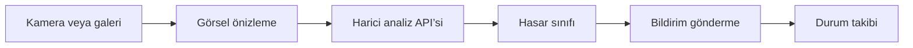

<div align="center">

# Road Damage AI

### Yoldaki hasarı yakala, bildir, takip et.


[](LICENSE)

Kamera ve galeriden seçilen yol görüntülerini harici analiz servisine gönderen, hasar bildirimlerini takip eden mobil uygulama.

**Mobil destekli yol hasarı sınıflandırma**

[Projeyi keşfet](https://github.com/silanpehlivan/road_damage_detection_app/tree/main) · [Kurulum ve ayrıntılar](#projeyi-çalıştırmak-ve-incelemek)

</div>

---

## İçeride neler var?

- **01** · Kamera ve galeriyle görsel seçimi
- **02** · D00, D10, D20 ve D40 hasar türlerinin gösterimi
- **03** · Bildirim oluşturma ve durum takibi

## Projeyi çalıştırmak ve incelemek

<details>
<summary><strong>Kurulum, kod yapısı ve teknik notları aç</strong></summary>

## Problem ve yaklaşım

Yol hasarlarını görsel üzerinden raporlamak ve bildirimlerin inceleme durumunu izlemek için mobil bir iş akışı sunar. **Bu depo mobil istemciyi içerir; model eğitimi ve FastAPI sunucusu bu depoda bulunmaz.**

## İş akışı



| Kod | Gösterilen hasar |
|---|---|
| D00 | Boyuna çatlak |
| D10 | Enine çatlak |
| D20 | Timsah çatlağı |
| D40 | Çukur |

## Teknik inceleme

| Dosya | Sorumluluk |
|---|---|
| [App.js](App.js) | Görsel seçimi, multipart yükleme, analiz ve bildirim ekranları |
| [package.json](package.json) | Bağımlılıklar ve çalıştırma komutları |
| [app.json](app.json) | Expo uygulama yapılandırması |
| [eas.json](eas.json) | EAS yapılandırması |

App.js içindeki `API_BASE_URL`, çalışır bir analiz sunucusuna göre ayarlanmalıdır. Fiziksel cihazın sunucuya ağ üzerinden erişebilmesi gerekir.

## Yerel kullanım

```powershell
git clone https://github.com/silanpehlivan/road_damage_detection_app.git
cd road_damage_detection_app
npm ci
npx expo start
```

Kamera ve galeri erişimi için cihaz izinlerini verin. Analiz ve bildirim işlemleri harici backend hazır olmadan tamamlanamaz.

### Kapsam ve sınırlar

- Bu depodan model doğruluğu, F1 veya gecikme sonucu doğrulanamaz; bu nedenle sayısal başarı iddiası sunulmaz.
- Hasar sınıfı gösterimi, görüntü üzerinde bounding box üreten nesne tespiti yapıldığı anlamına gelmez.
- Kullanıcı/yönetici ekranı seçimi, sunucu tarafında kimlik doğrulama ve yetkilendirme yerine geçmez.
- Gerçek kullanım için API erişimi, TLS, yükleme sınırları ve görsel verisinin saklama koşulları backend tarafında değerlendirilmelidir.

</details>

---

**© 2026 Semanur YILDIRIM ve Şilan PEHLİVAN**  
Kullanım ve dağıtım koşulları: [MIT lisansı](LICENSE).
